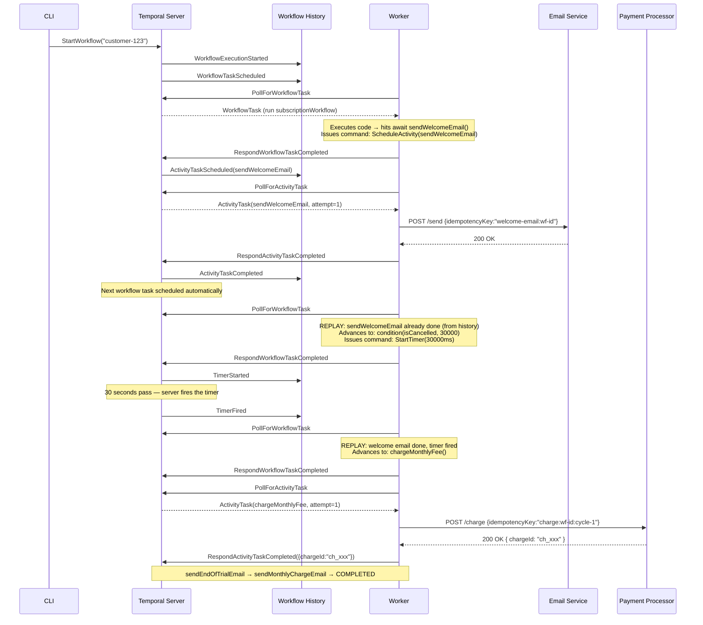
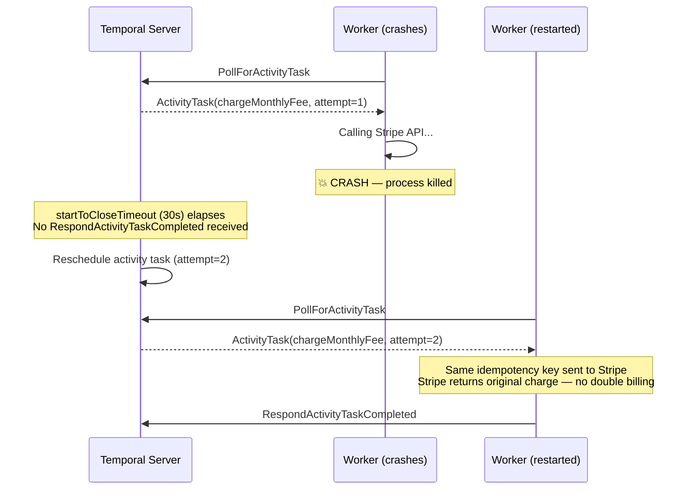
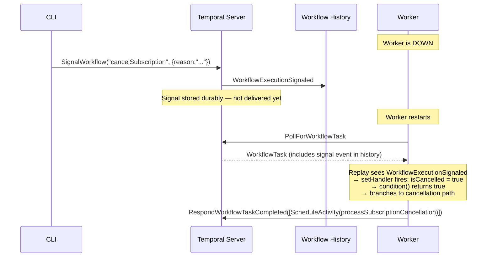
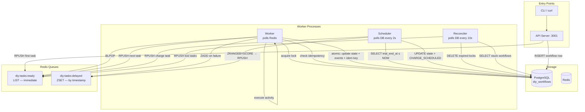
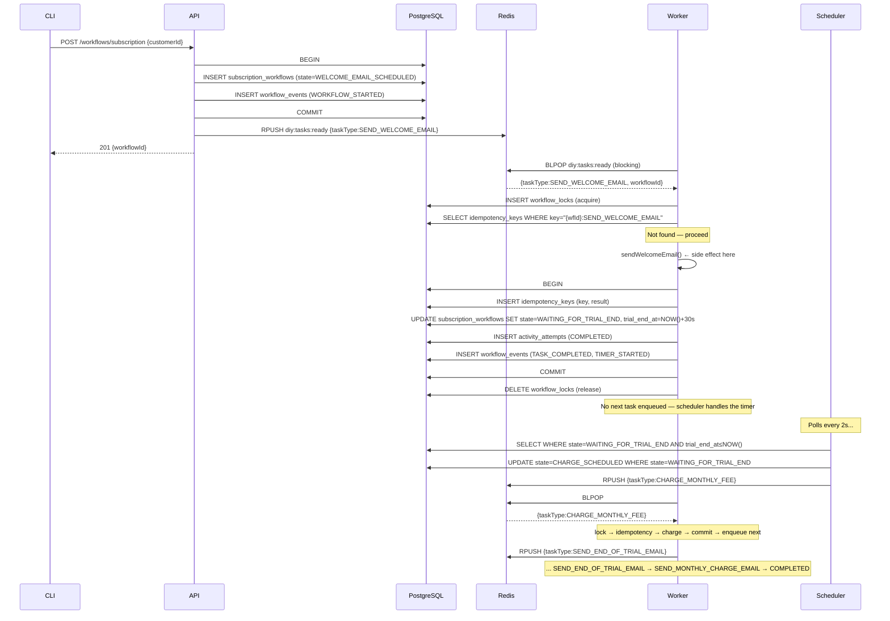
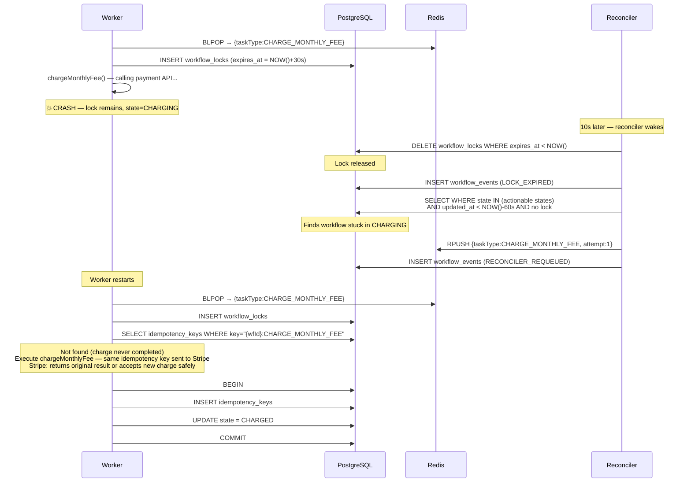
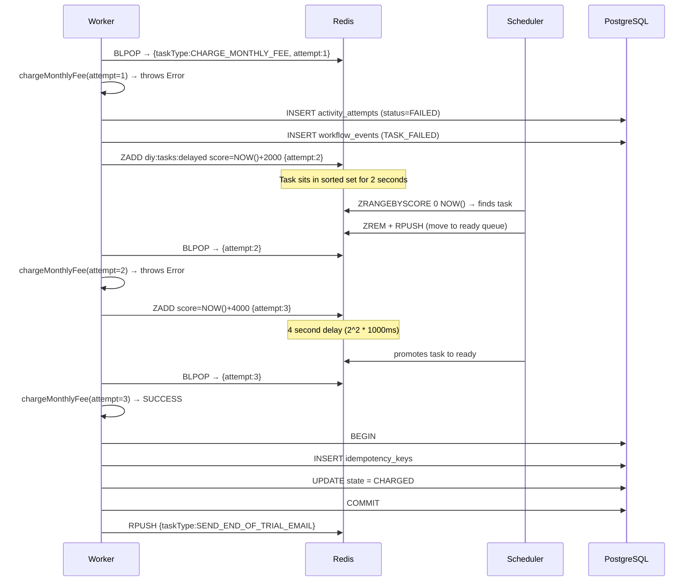

# Architecture Deep-Dive

This document explains how both implementations work internally, using sequence diagrams to show the exact flow of data, state, and control.

---

## Temporal Version

### What Makes a Workflow "Durable"

Temporal achieves durability through **event sourcing**. Every significant action in the workflow — activity scheduled, timer started, signal received — is appended as an immutable event to a history log. The workflow's current execution state is always reconstructable from this history.

```
Workflow History (append-only, stored in Temporal's DB)
───────────────────────────────────────────────────────
 1  WorkflowExecutionStarted   { input: "customer-123" }
 2  WorkflowTaskScheduled
 3  WorkflowTaskStarted
 4  WorkflowTaskCompleted      { commands: [ScheduleActivity(sendWelcomeEmail)] }
 5  ActivityTaskScheduled      { activityType: "sendWelcomeEmail" }
 6  ActivityTaskStarted
 7  ActivityTaskCompleted      { result: null }
 8  WorkflowTaskScheduled
 9  WorkflowTaskStarted
10  WorkflowTaskCompleted      { commands: [StartTimer(30000ms)] }
11  TimerStarted               { timerId: "1", fireAt: +30s }
    ...worker crashes here...
    ...30 seconds pass...
12  TimerFired                 { timerId: "1" }
13  WorkflowTaskScheduled
    ...worker restarts and picks this up...
```

When the worker restarts, it receives event 13 and **replays** events 1–12 through the workflow code. The code sees that `sendWelcomeEmail` already completed (event 7) and skips the actual call, injecting the result directly from history. The code sees that the timer already fired (event 12) and returns immediately from `condition()`. Execution resumes at the next `await`.

### Happy Path Sequence



### Worker Crash and Recovery



### Signal Delivery (Cancellation)



---

## DIY Version

### Component Map



### Happy Path Sequence



### Crash Recovery (Reconciler)



### Retry with Exponential Backoff



---

## Database Schema

```sql
-- Canonical state of each workflow run
-- The `state` column is the "program counter"
subscription_workflows
  id               UUID PRIMARY KEY
  customer_id      VARCHAR UNIQUE
  state            VARCHAR          -- STARTED → ... → COMPLETED | CANCELLED | FAILED
  trial_end_at     TIMESTAMPTZ      -- set after welcome email; polled by scheduler
  metadata         JSONB            -- { chargeId, amount } from activities
  cancellation_reason TEXT
  created_at, updated_at TIMESTAMPTZ

-- Append-only audit log (equivalent to Temporal's workflow history)
workflow_events
  id               BIGSERIAL PRIMARY KEY
  workflow_id      UUID → subscription_workflows
  event_type       VARCHAR  -- WORKFLOW_STARTED, TASK_COMPLETED, TIMER_FIRED, ...
  event_data       JSONB
  created_at       TIMESTAMPTZ

-- Every attempt to run every activity
activity_attempts
  id               UUID PRIMARY KEY
  workflow_id      UUID
  activity_type    VARCHAR   -- SEND_WELCOME_EMAIL, CHARGE_MONTHLY_FEE, ...
  attempt_number   INT
  status           VARCHAR   -- PENDING | RUNNING | COMPLETED | FAILED
  started_at, completed_at TIMESTAMPTZ
  error_message    TEXT
  result           JSONB

-- Deduplication: checked before every activity execution
idempotency_keys
  key              VARCHAR PRIMARY KEY  -- "{workflowId}:{activityType}"
  workflow_id      UUID
  activity_type    VARCHAR
  result           JSONB
  created_at       TIMESTAMPTZ

-- Distributed mutex: prevents two workers processing same workflow
workflow_locks
  workflow_id      UUID PRIMARY KEY
  locked_by        VARCHAR   -- worker process ID
  locked_at        TIMESTAMPTZ
  expires_at       TIMESTAMPTZ   -- TTL; reconciler cleans up expired locks

-- Activities that exhausted all retry attempts
dead_letter_tasks
  id               UUID PRIMARY KEY
  workflow_id      UUID
  activity_type    VARCHAR
  payload          JSONB
  error_message    TEXT
  retry_count      INT
  failed_at        TIMESTAMPTZ
```

---

## Concept Mapping

| Temporal concept | DIY equivalent |
|-----------------|----------------|
| Workflow execution | Row in `subscription_workflows` |
| Workflow history | `workflow_events` table (audit log, not used for replay) |
| Workflow state | `state` VARCHAR column — explicit, queryable |
| `workflow.sleep(ms)` | `trial_end_at` column + Scheduler polling `SELECT WHERE trial_end_at ≤ NOW()` |
| Activity task | Task JSON pushed to Redis `diy:tasks:ready` |
| Activity retry policy | Worker catches exception → `ZADD diy:tasks:delayed` with backoff score |
| Activity idempotency | `idempotency_keys` table — `INSERT ON CONFLICT DO NOTHING` |
| Signal | HTTP POST to cancel API → `UPDATE state=CANCELLATION_REQUESTED` + task enqueue |
| Sticky worker / serialisation | `workflow_locks` table with TTL |
| Server heartbeat timeout | Reconciler: `DELETE FROM workflow_locks WHERE expires_at < NOW()` |
| Workflow task reassignment | Reconciler: detects stale `updated_at` + no lock → re-enqueues |
| Temporal UI | `GET /workflows/subscription/:customerId/history` endpoint |
| Namespace | Not implemented (would be a `tenant_id` column) |
