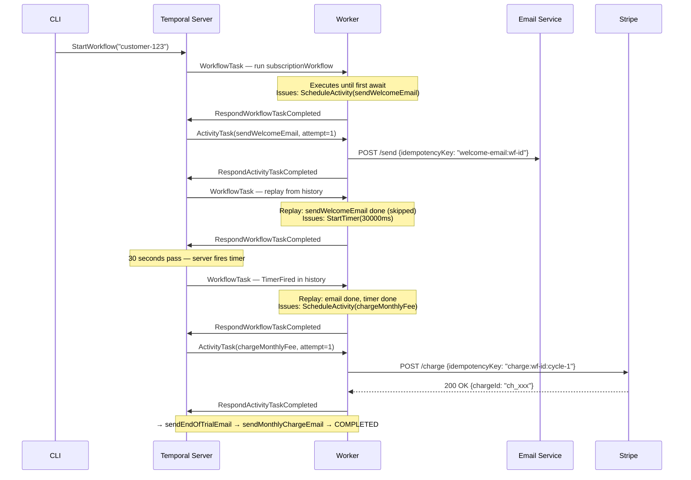
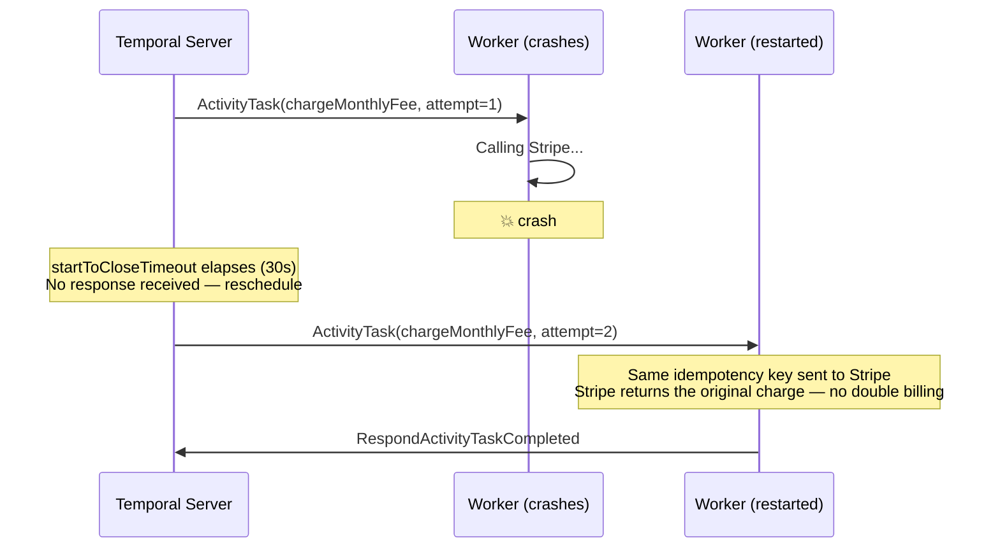
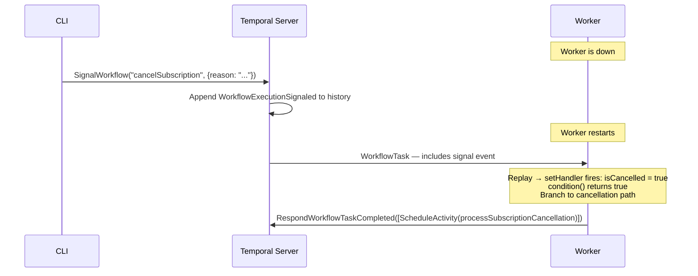
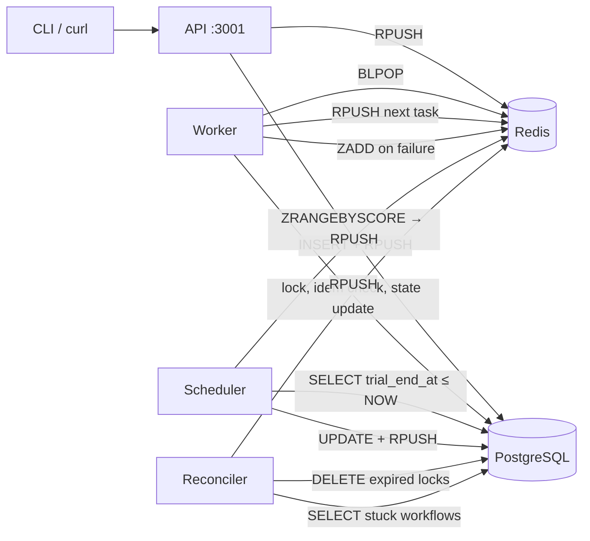
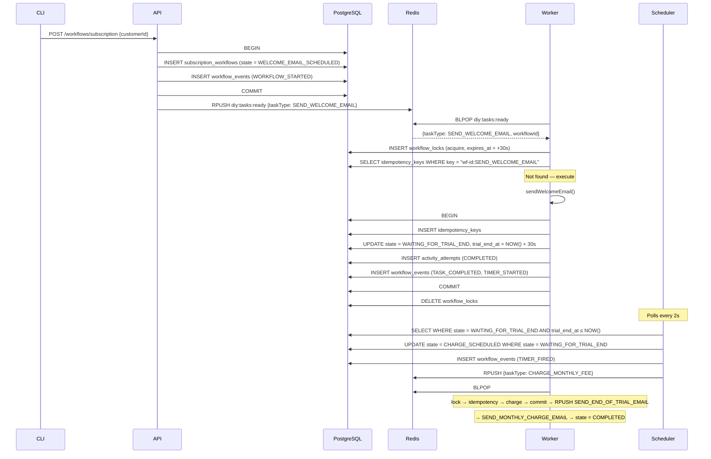
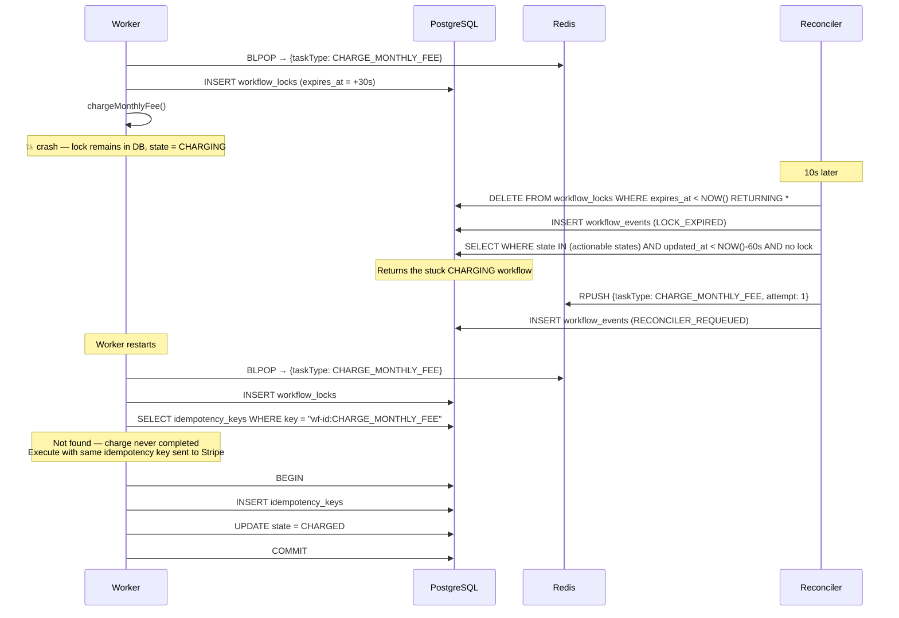
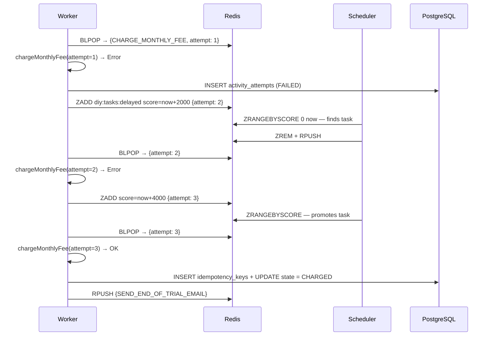

# Architecture

---

## Temporal version

Temporal achieves durability through event sourcing. Every action — activity scheduled, timer started, signal received — is appended to an immutable history log. Workflow state is always reconstructable from this log.

```
WorkflowExecutionStarted   { input: "customer-123" }
WorkflowTaskScheduled
WorkflowTaskStarted
WorkflowTaskCompleted      { commands: [ScheduleActivity(sendWelcomeEmail)] }
ActivityTaskScheduled      { activityType: "sendWelcomeEmail" }
ActivityTaskStarted
ActivityTaskCompleted      { result: null }
WorkflowTaskCompleted      { commands: [StartTimer(30000ms)] }
TimerStarted               { fireAt: +30s }
── worker crashes here ──
── 30 seconds pass ──
TimerFired
WorkflowTaskScheduled      ← worker restarts, picks this up
```

When the worker gets `WorkflowTaskScheduled` after the crash, it **replays** events 1–9 through the workflow code. `sendWelcomeEmail` already has a completion event so the SDK injects the result without calling the activity. `condition()` sees `TimerFired` and returns immediately. Execution continues at the next `await` — `chargeMonthlyFee`.

### Happy path



### Worker crash mid-activity



### Signal delivery while worker is down



---

## DIY version

### Component overview



### Happy path



### Crash recovery



### Retry with exponential backoff



---

## Database schema

```sql
-- Canonical workflow state. `state` is the program counter.
subscription_workflows (
  id               UUID PRIMARY KEY,
  customer_id      VARCHAR UNIQUE,
  state            VARCHAR,       -- the only source of truth for "where are we"
  trial_end_at     TIMESTAMPTZ,   -- set after welcome email; polled by scheduler
  metadata         JSONB,         -- { chargeId, amount } propagated through tasks
  cancellation_reason TEXT,
  created_at       TIMESTAMPTZ,
  updated_at       TIMESTAMPTZ
)

-- Append-only. Never updated, never deleted.
-- Unlike Temporal history, this is not used for replay — it's an audit log.
workflow_events (
  id          BIGSERIAL PRIMARY KEY,
  workflow_id UUID,
  event_type  VARCHAR,   -- WORKFLOW_STARTED | TASK_COMPLETED | TIMER_FIRED | RECONCILER_REQUEUED | …
  event_data  JSONB,
  created_at  TIMESTAMPTZ
)

-- One row per execution attempt. Shows retry history.
activity_attempts (
  id             UUID PRIMARY KEY,
  workflow_id    UUID,
  activity_type  VARCHAR,
  attempt_number INT,
  status         VARCHAR,   -- PENDING | RUNNING | COMPLETED | FAILED
  started_at     TIMESTAMPTZ,
  completed_at   TIMESTAMPTZ,
  error_message  TEXT,
  result         JSONB
)

-- Deduplication. Checked before every activity. Written atomically with state update.
-- Key format: "{workflowId}:{activityType}"
idempotency_keys (
  key           VARCHAR PRIMARY KEY,
  workflow_id   UUID,
  activity_type VARCHAR,
  result        JSONB,
  created_at    TIMESTAMPTZ
)

-- Distributed mutex. One row per active workflow, with a TTL.
-- Reconciler deletes rows where expires_at < NOW().
workflow_locks (
  workflow_id UUID PRIMARY KEY,
  locked_by   VARCHAR,     -- worker process identifier
  locked_at   TIMESTAMPTZ,
  expires_at  TIMESTAMPTZ
)

-- Tasks that exhausted all retry attempts.
dead_letter_tasks (
  id            UUID PRIMARY KEY,
  workflow_id   UUID,
  activity_type VARCHAR,
  payload       JSONB,
  error_message TEXT,
  retry_count   INT,
  failed_at     TIMESTAMPTZ
)
```

---

## Concept mapping

| Temporal | DIY |
|---|---|
| Workflow execution | row in `subscription_workflows` |
| Workflow history (for replay) | not applicable — DIY replays from `state` column, not events |
| `workflow_events` table | audit log only; not authoritative |
| `workflow.sleep(ms)` | `trial_end_at` column + `scheduler.ts` polling `SELECT WHERE trial_end_at ≤ NOW()` |
| Activity task on task queue | JSON object pushed to `diy:tasks:ready` Redis LIST |
| Retry policy | `ZADD diy:tasks:delayed` with score = `now + 2^attempt * 1000` |
| `defineSignal` + `setHandler` | HTTP POST → `UPDATE state = CANCELLATION_REQUESTED` + RPUSH |
| Server heartbeat / task reassignment | `reconciler.ts` — deletes expired locks, re-enqueues stuck tasks |
| Sticky queue (single-worker serialisation) | `workflow_locks` with TTL |
| `WorkflowExecutionFailed` status | row in `dead_letter_tasks` + `state = FAILED` |
