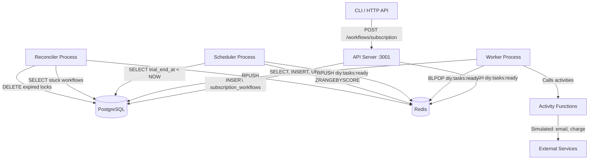
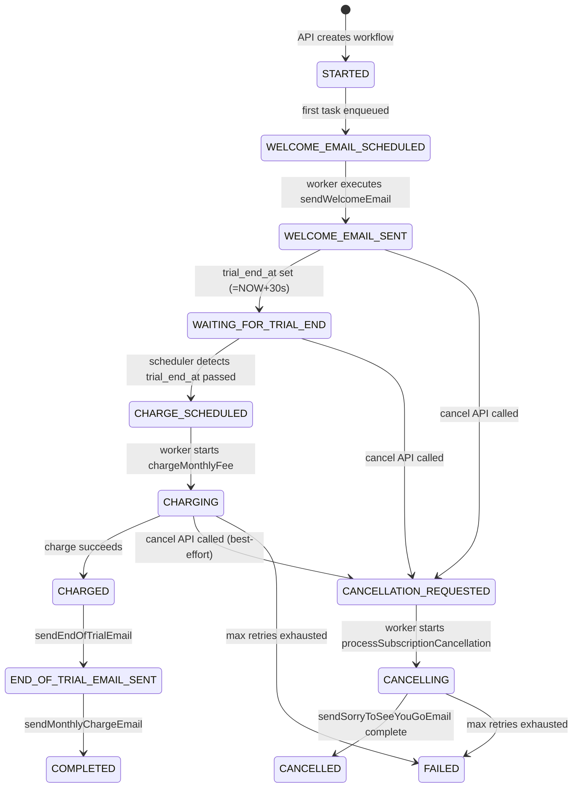
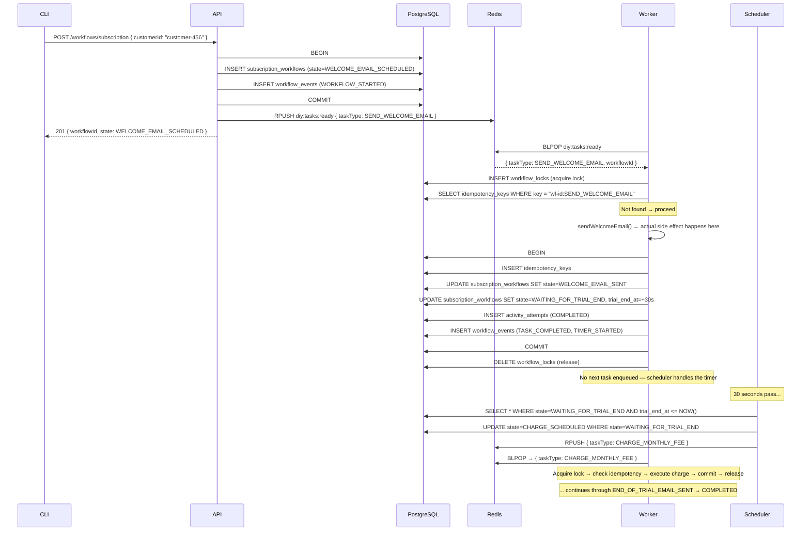
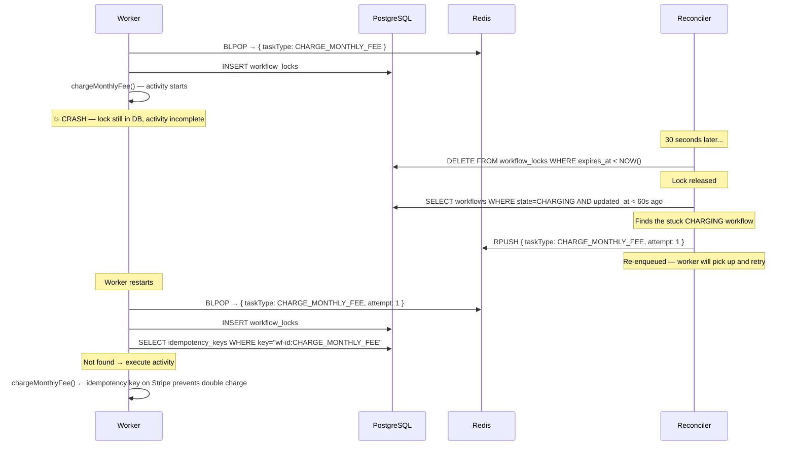

# DIY Architecture

## System Overview

## State Machine

## Full Request Flow

## Failure Recovery Flow

## Database Tables and Their Purpose

### `subscription_workflows`
The canonical state of each workflow. Every other table references this.
The `state` column is the "program counter" of the workflow.

### `workflow_events`
Append-only history log. Every state transition, activity result, and signal is recorded here. This is NOT used for replay (unlike Temporal's history) — it's an audit log.

### `activity_attempts`
Tracks each attempt to run each activity. Shows retry history. Lets you answer: "How many times did we try to charge customer-456 and why did each attempt fail?"

### `idempotency_keys`
Prevents duplicate execution. Before running any activity, check this table. After completing, insert a record. The worker also checks this to handle duplicate queue messages.

### `workflow_locks`
Distributed mutex. Prevents two workers from processing the same workflow simultaneously. Has a TTL so crashed workers don't permanently block workflows.

### `dead_letter_tasks`
Activities that exhausted all retries. Requires manual intervention to re-drive or compensate.

## Processes and Their Responsibilities

| Process | Analogy in Temporal | Responsibility |
|---------|---------------------|----------------|
| **API** | Temporal Client | Accept start/cancel requests, create DB records, enqueue first task |
| **Worker** | Worker + Activity Worker | Poll Redis, acquire lock, check idempotency, execute activity, update state |
| **Scheduler** | Temporal Server (timers) | Poll for expired `trial_end_at`, enqueue CHARGE task; promote delayed queue |
| **Reconciler** | Temporal Server (heartbeats) | Release expired locks, detect stuck workflows, re-enqueue lost tasks |
