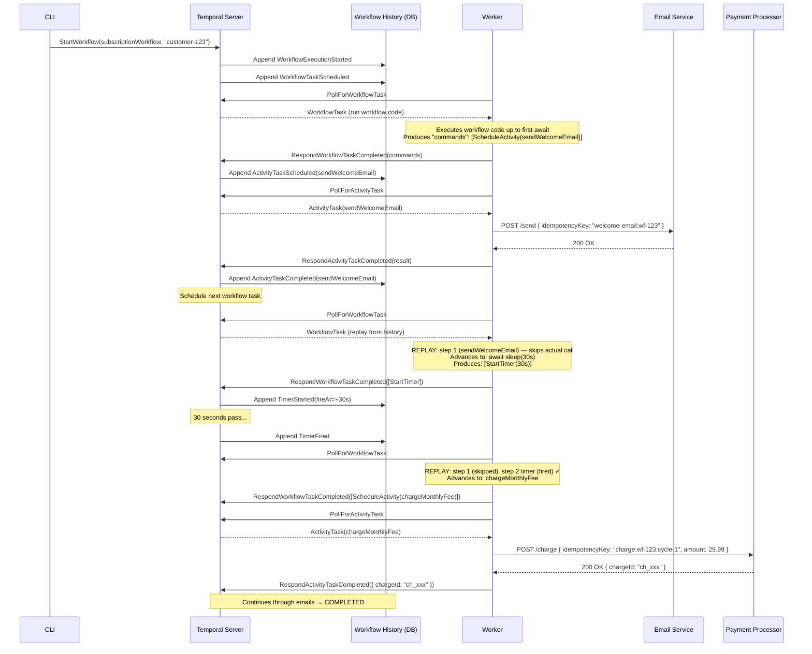
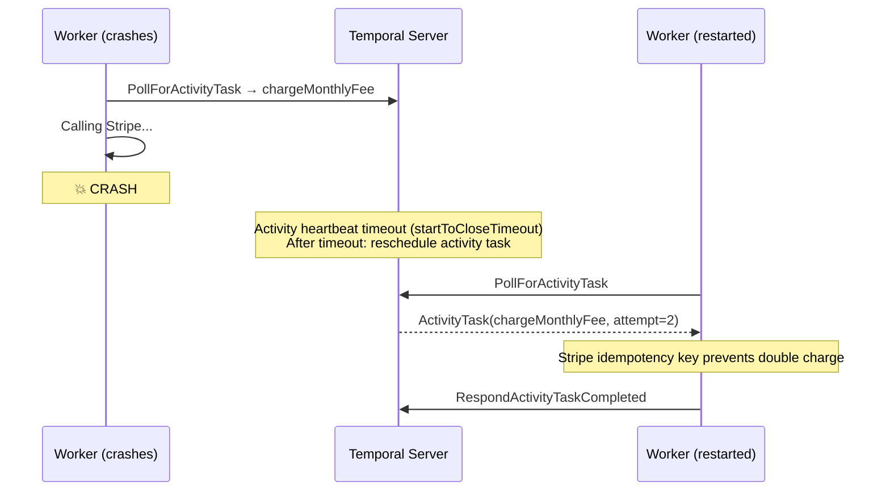
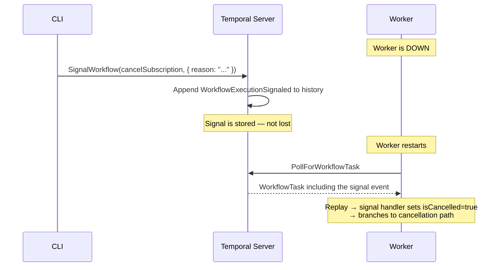

# Temporal Architecture

## How It Works

## Worker Crash Recovery

## Signal Delivery During Downtime

## Component Responsibilities

| Component | Responsibility |
|-----------|---------------|
| **Temporal Server** | Receives commands, stores history, schedules workflow/activity tasks, fires timers, delivers signals |
| **Worker** | Polls for tasks, executes workflow code (sandboxed replay), executes activities (real Node.js), reports results |
| **Workflow History** | Authoritative record of all events — the "source of truth" for workflow state. Enables crash recovery via replay |
| **Task Queue** | Named channel connecting server to workers. Workers poll their queue. Multiple workers on same queue = automatic load balancing |

## What Temporal Gives You For Free

| Problem | Temporal's Solution |
|---------|---------------------|
| Worker crash mid-activity | Reschedule after startToCloseTimeout |
| Worker crash during sleep | Timer stored server-side, fires when worker returns |
| Duplicate activity execution | History records completion; replay skips completed activities |
| Signal delivery to sleeping workflow | Signals stored in history; delivered on next workflow task |
| Concurrent workflow execution | Server assigns each workflow task to exactly one worker |
| Retry with backoff | Configured in `proxyActivities` retry policy |
| Activity timeout | `startToCloseTimeout` / `scheduleToCloseTimeout` |
| Long-running workflow state | Encoded in workflow history — survives all restarts |
